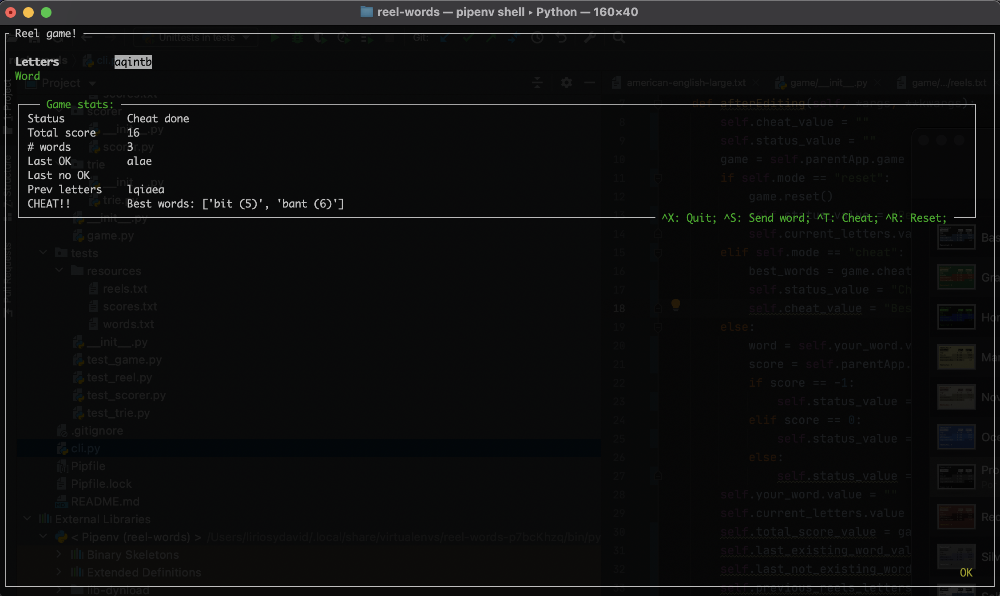

# Reel Game

A simple scrabble-like game, built in Python, using the npyscreen library for the cli game.

## Installation

Follow this steps to install and play the game:

1. Install `python` version >= 3.7
2. Install `pypenv`
3. To install the dependencies and virtual environment, in the root folder execute:

```
   > pipenv install
   > pipenv shell
``` 

4. Run the game with `python cli.py`

## Game

Once you execute the game, you should see a screen like:



- Use the arrow keys to move to the Word field to type your word.
- Use `ctrl+s` to send the typed word to the game.
- Check the updated game statistics on the screen.
- Quit using `ctrl+x`
- Reset the game using `ctrl+r`
- Cheat, retrieving a list of the best possible words, using `ctrl+t`
